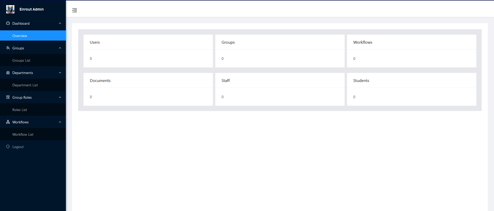

# EnroutAdmin

  <b>Enrout-Admin is the administrator portal for the University Document Routing and Management System (Enrout), a web-based application designed to streamline the routing and management of official documents within a university. This system is built using Angular, a popular JavaScript framework for building dynamic web applications.</b> 

## Development server

Run `ng serve` for a dev server. Navigate to `http://localhost:4200/`. The app will automatically reload if you change any of the source files.

## Code scaffolding

Run `ng generate component component-name` to generate a new component. You can also use `ng generate directive|pipe|service|class|guard|interface|enum|module`.

## Build

Run `ng build` to build the project. The build artifacts will be stored in the `dist/` directory.

## Running unit tests

Run `ng test` to execute the unit tests via [Karma](https://karma-runner.github.io).

## Running end-to-end tests

Run `ng e2e` to execute the end-to-end tests via a platform of your choice. To use this command, you need to first add a package that implements end-to-end testing capabilities.

## ➤ Contributors

|  |
|:--------------------------------------------------:|
| [Bolorunduro Valiant-Joshua](https://twitter.com/bolorundurovb) |
| [halexanderfleming@gmail.com](mailto:halexanderfleming@gmail.com) |
| 🔥                                               |

## ➤ License

Licensed under [MIT](https://opensource.org/licenses/MIT).

## Further help

To get more help on the Angular CLI use `ng help` or go check out the [Angular CLI Overview and Command Reference](https://angular.io/cli) page.
